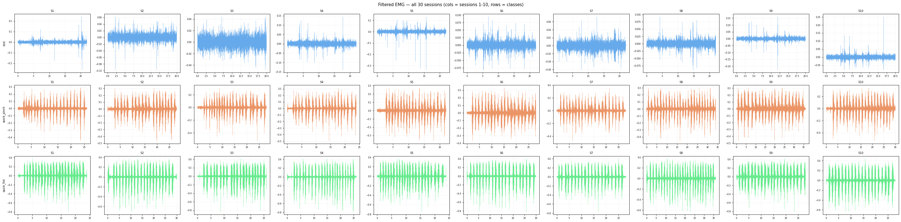
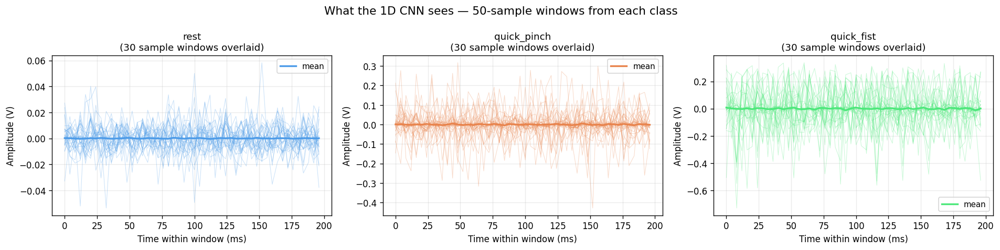
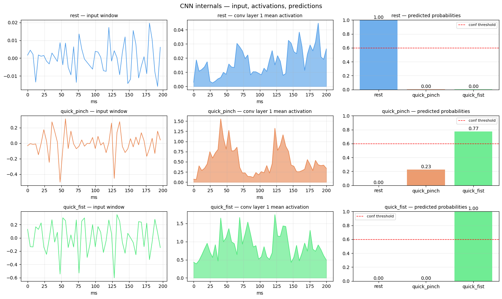
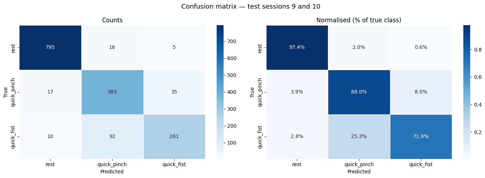
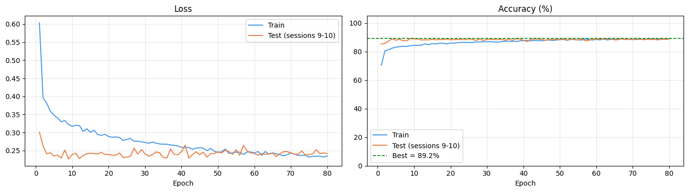

# EMG Gesture Recognition on ESP32-S3 (TinyML)

Real-time EMG (Electromyography) gesture recognition system running entirely on an ESP32-S3 microcontroller using a custom 1D Convolutional Neural Network (CNN).

The project acquires muscle activity signals using BioAmp sensors, applies digital signal processing, performs on-device inference, and converts detected gestures into human-computer interaction events.

---

## Features

- Real-time EMG acquisition
- 20–120 Hz Butterworth band-pass filtering
- Sliding-window inference
- Custom 1D CNN implemented in Embedded C
- No TensorFlow Lite Micro required
- Fully offline inference on ESP32-S3
- Gesture state machine
- Low-latency real-time classification

Supported gestures:

| Class | Gesture |
|---------|---------|
| 0 | Rest |
| 1 | Quick Pinch |
| 2 | Quick Fist |

---

## Hardware

### Sensors

- Upside Down Labs Muscle BioAmp Candy
- Muscle BioAmp Band

### Microcontrollers

- ESP32-S3
- Seeed Studio XIAO ESP32S3 Sense
  - 8 MB PSRAM
  - 8 MB Flash

---

## Software Stack

### Training

- Python
- PyTorch
- NumPy
- SciPy
- Scikit-Learn
- Google Colab

### Deployment

- ESP-IDF v5.4
- Embedded C

---

## Project Architecture

```text
EMG Sensor
    │
    ▼
ESP32-S3 ADC Sampling
    │
    ▼
Bandpass Filter (20–120 Hz)
    │
    ▼
50-Sample Sliding Window
    │
    ▼
1D CNN Inference
    │
    ▼
Gesture Classification
    │
    ▼
Finite State Machine
    │
    ▼
Application Actions
```

---

## Dataset

Data was collected using a BioAmp EMG sensor across **30 independent recording sessions**.

Classes:

- Rest
- Quick Pinch
- Quick Fist

Training sessions:
- Sessions 1–8

Testing sessions:
- Sessions 9–10

This cross-session split helps evaluate generalization on unseen recordings.

---

## CNN Architecture

```text
Input (1 × 50)

↓ Conv1D (32 filters, kernel=5)
↓ ReLU
↓ MaxPool

↓ Conv1D (64 filters, kernel=3)
↓ ReLU
↓ MaxPool

↓ Conv1D (64 filters, kernel=3)
↓ ReLU

↓ Global Average Pooling

↓ Fully Connected (32)

↓ Fully Connected (3)

↓ Softmax
```

---

## Training Results

### Test Accuracy

**89.2%**

### Per-Class Accuracy

| Gesture | Accuracy |
|----------|-----------|
| Rest | 97.4% |
| Quick Pinch | 88.0% |
| Quick Fist | 71.9% |

---

## Training Visualizations

### Session Overview



### CNN Input Windows



### CNN Internals



### Confusion Matrix



### Training Curves



---

## Repository Structure

```text
.
├── emg_training
│   ├── EMG_Gesture_Training_V3.ipynb
│   └── emg_results_v3
│       ├── all_sessions_v3.png
│       ├── cnn_input_windows.png
│       ├── cnn_internals.png
│       ├── confusion_matrix_v3.png
│       ├── training_curves_v3.png
│       ├── gesture_model_v3.pth
│       └── model_weights_v3.h
│
├── emg_inference_v3
│   ├── CMakeLists.txt
│   ├── sdkconfig.defaults
│   ├── main
│   │   ├── main.c
│   │   ├── cnn_inference.c
│   │   ├── cnn_inference.h
│   │   ├── emg_filter.c
│   │   ├── emg_filter.h
│   │   ├── gesture_fsm.c
│   │   ├── gesture_fsm.h
│   │   ├── config.h
│   │   └── model_weights_v3.h
│   └── build
│
└── README.md
```

---

## Building Firmware

### Prerequisites

- ESP-IDF v5.4+
- ESP32-S3 Toolchain

### Build

```bash
cd emg_inference_v3

idf.py set-target esp32s3

idf.py build
```

### Flash

```bash
idf.py -p /dev/ttyUSB0 flash monitor
```

---

## Model Export

The trained PyTorch model is exported to:

```text
model_weights_v3.h
```

The exported weights are linked directly into the ESP-IDF firmware and executed through a custom inference engine.

---

## Future Improvements

- Additional gesture classes
- BLE HID mouse integration
- IMU-assisted gesture recognition
- Model quantization
- TensorFlow Lite Micro comparison
- Continuous learning pipeline

---

## Author

Jiten

B.Tech Artificial Intelligence & Data Science  
University School of Automation and Robotics (USAR)  
Guru Gobind Singh Indraprastha University (GGSIPU)
